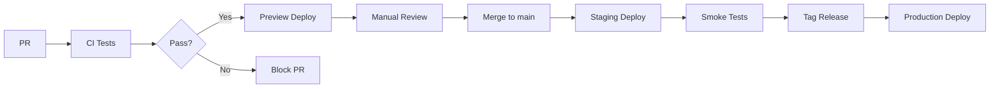

# CI/CD — Plan Testów i Deploymentu

## Przegląd

Projekt ~~bez~~RADNY używa monorepo z trzema aplikacjami:

- `apps/api` — Backend Fastify
- `apps/frontend` — Frontend Next.js
- `apps/worker` — Worker BullMQ
- `packages/shared` — Współdzielone typy

## Pipeline CI (GitHub Actions)

### 1. Etap: Walidacja kodu

| Job           | Komenda             | Cel                             |
| ------------- | ------------------- | ------------------------------- |
| **Lint**      | `npm run lint`      | Sprawdzenie stylu kodu (ESLint) |
| **TypeCheck** | `npm run typecheck` | Walidacja typów TypeScript      |
| **Build**     | `npm run build`     | Kompilacja wszystkich pakietów  |

### 2. Etap: Testy jednostkowe (do implementacji)

```yaml
test:
  runs-on: ubuntu-latest
  steps:
    - npm run test:api # Testy API (Vitest)
    - npm run test:frontend # Testy komponentów (Jest/Vitest)
    - npm run test:shared # Testy pakietu shared
```

**Priorytetowe testy jednostkowe:**

| Moduł                     | Plik                                     | Co testować                                  |
| ------------------------- | ---------------------------------------- | -------------------------------------------- |
| `ai-client-factory.ts`    | `__tests__/ai-client-factory.test.ts`    | Tworzenie klientów AI dla różnych providerów |
| `document-processor.ts`   | `__tests__/document-processor.test.ts`   | OCR, ekstrakcja tekstu z PDF                 |
| `document-scorer.ts`      | `__tests__/document-scorer.test.ts`      | Obliczanie score dokumentów                  |
| `tool-prompt-service.ts`  | `__tests__/tool-prompt-service.test.ts`  | Generowanie promptów dla narzędzi            |
| `voice-action-service.ts` | `__tests__/voice-action-service.test.ts` | Parsowanie intencji głosowych                |

### 3. Etap: Testy integracyjne

**API Integration Tests:**

```typescript
// apps/api/__tests__/integration/
describe("Documents API", () => {
  test("POST /documents/:id/analyze returns taskId", async () => {
    const response = await request(app)
      .post("/api/documents/123/analyze")
      .set("Authorization", "Bearer <token>");
    expect(response.body.async).toBe(true);
    expect(response.body.taskId).toBeDefined();
  });
});
```

**Priorytetowe testy integracyjne:**

| Endpoint                          | Scenariusz                                 |
| --------------------------------- | ------------------------------------------ |
| `POST /api/chat`                  | Wysłanie wiadomości, otrzymanie odpowiedzi |
| `POST /api/documents/:id/analyze` | Rozpoczęcie analizy asynchronicznej        |
| `GET /api/dashboard/tasks`        | Pobranie zadań w tle                       |
| `POST /api/voice/command`         | Przetworzenie polecenia głosowego          |

### 4. Etap: Testy E2E (Playwright)

```yaml
e2e:
  runs-on: ubuntu-latest
  services:
    redis:
      image: redis:7
    postgres:
      image: supabase/postgres:15
  steps:
    - npm run e2e
```

**Scenariusze E2E:**

| ID      | Scenariusz           | Kroki                                                                                                         |
| ------- | -------------------- | ------------------------------------------------------------------------------------------------------------- |
| E2E-001 | Login użytkownika    | 1. Otwórz /login 2. Wprowadź email/hasło 3. Sprawdź redirect do /dashboard                                    |
| E2E-002 | Analiza dokumentu    | 1. Otwórz /documents 2. Kliknij "Analizuj" 3. Sprawdź redirect do /dashboard 4. Sprawdź wpis w widgecie zadań |
| E2E-003 | Chat z AI            | 1. Otwórz /chat 2. Wyślij wiadomość 3. Sprawdź odpowiedź AI                                                   |
| E2E-004 | Narzędzie Quick Tool | 1. Otwórz /chat?tool=interpelation 2. Wypełnij formularz 3. Kliknij "Generuj" 4. Sprawdź wygenerowaną treść   |
| E2E-005 | Polecenie głosowe    | 1. Aktywuj mikrofon 2. Powiedz "Przygotuj interpelację" 3. Sprawdź otwarcie modalu narzędzia                  |

## Pipeline CD (Deployment)

### Środowiska

| Env            | Trigger        | URL                        |
| -------------- | -------------- | -------------------------- |
| **Preview**    | PR do `main`   | `pr-{number}.bezradny.dev` |
| **Staging**    | Push do `main` | `staging.bezradny.dev`     |
| **Production** | Tag `v*`       | `bezradny.dev`             |

### Deployment Flow



### Deployment Checklist

- [ ] Wszystkie testy CI przechodzą
- [ ] Brak błędów TypeScript
- [ ] Migracje DB wykonane
- [ ] Zmienne środowiskowe ustawione
- [ ] Health check `/health` zwraca 200

## Zmienne środowiskowe CI

```yaml
env:
  # Supabase
  SUPABASE_URL: ${{ secrets.SUPABASE_URL }}
  SUPABASE_SERVICE_ROLE_KEY: ${{ secrets.SUPABASE_SERVICE_KEY }}

  # Redis
  REDIS_HOST: localhost
  REDIS_PORT: 6379

  # API
  API_PORT: 3001

  # AI (opcjonalne dla testów)
  OPENAI_API_KEY: ${{ secrets.OPENAI_API_KEY }}
```

## Metryki jakości

### Code Coverage Targets

| Pakiet            | Target |
| ----------------- | ------ |
| `apps/api`        | 70%    |
| `apps/frontend`   | 60%    |
| `apps/worker`     | 70%    |
| `packages/shared` | 90%    |

### Performance Budgets

| Metryka                 | Target  |
| ----------------------- | ------- |
| Frontend LCP            | < 2.5s  |
| API Response Time (p95) | < 500ms |
| Build Time              | < 5min  |

## Harmonogram implementacji

### Faza 1: Podstawowe CI (Tydzień 1) ✅ DONE

- [x] Lint + TypeCheck w GitHub Actions
- [x] Build wszystkich pakietów
- [ ] Cache node_modules

**Status testów (2026-01-25):**

| Job           | Status   | Szczegóły                                 |
| ------------- | -------- | ----------------------------------------- |
| **TypeCheck** | ✅ PASS  | 0 błędów                                  |
| **Build**     | ✅ PASS  | shared + frontend + api + worker          |
| **Lint**      | ⚠️ 4 err | 4 błędy, 29 ostrzeżeń (nie blokują build) |

### Faza 2: Testy jednostkowe (Tydzień 2-3) ✅ STARTED

- [x] Setup Vitest (`vitest.config.ts`, skrypty w package.json)
- [x] Testy `deep-research-service` (7 testów PASS)
- [ ] Testy `ai-client-factory` (wymaga mockowania Supabase)
- [ ] Testy `document-processor`
- [ ] Testy `document-scorer`

**Komendy testowe:**

```bash
npm run test           # Wszystkie testy
npm run test:api       # Testy API
npm run test:coverage  # Testy z coverage
```

### Faza 3: Testy integracyjne (Tydzień 4) ✅ STARTED

- [x] Setup testowy (`test-utils.ts` z mockami Supabase)
- [x] Testy API Health Check (6 testów)
- [ ] Testy kolejek BullMQ

**Pokrycie testami:**

```text
 Test Files  4 passed (4)
      Tests  37 passed (37)
      Duration  ~1s
```

**Pliki testów:**

- `deep-research-service.test.ts` (7 testów)
- `document-scorer.test.ts` (11 testów)
- `tool-prompt-service.test.ts` (13 testów)
- `api-health.test.ts` (6 testów)

### Faza 4: Testy E2E (Tydzień 5-6) ✅ DONE

- [x] Setup Playwright (lokalne + Docker)
- [x] E2E-001: Login (4 testy PASS)
- [x] E2E-002: Documents (6 testów PASS)
- [x] E2E-003: Chat/Dashboard/Settings (8 testów PASS)

**Struktura E2E:**

```text
e2e/
├── playwright.config.ts
├── package.json
├── Dockerfile
└── tests/
    ├── login.spec.ts      # 4 testy
    ├── documents.spec.ts  # 6 testów
    └── chat.spec.ts       # 8 testów
```

**Wyniki E2E:**

```text
18 passed (23.6s)
```

**Komendy:**

```bash
npm run test:e2e         # Lokalne (wymaga npm i w e2e/)
npm run test:e2e:docker  # W kontenerze Docker
```

### Faza 5: CD Pipeline (Tydzień 7) ✅ DONE

- [x] GitHub Actions CI (lint, typecheck, build, test, e2e)
- [x] Deploy workflow (Vercel)
- [x] Vercel config (frontend)

**Workflows:**

- `.github/workflows/ci.yml` — CI pipeline (push/PR)
- `.github/workflows/deploy.yml` — Deploy (tag → production)

**Wymagane secrets w GitHub:**

- `VERCEL_TOKEN` — token Vercel
- `VERCEL_ORG_ID` — ID organizacji
- `VERCEL_PROJECT_ID` — ID projektu

## Narzędzia

| Cel        | Narzędzie                          |
| ---------- | ---------------------------------- |
| Unit Tests | Vitest                             |
| E2E Tests  | Playwright                         |
| Coverage   | c8 / istanbul                      |
| CI/CD      | GitHub Actions                     |
| Preview    | Vercel / Netlify                   |
| Monitoring | Sentry (errors), Grafana (metrics) |

## Komendy do dodania w package.json

```json
{
  "scripts": {
    "test": "npm-run-all test:shared test:api test:frontend",
    "test:shared": "npm --workspace packages/shared run test",
    "test:api": "npm --workspace apps/api run test",
    "test:frontend": "npm --workspace apps/frontend run test",
    "test:e2e": "playwright test",
    "test:coverage": "vitest run --coverage"
  }
}
```
