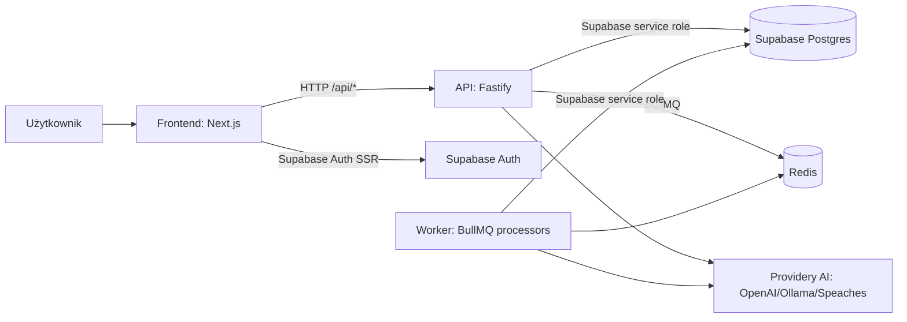

# 01 — Architektura (high-level)

## Cel systemu

System wspiera radnych samorządowych w pracy z dokumentami (pozyskanie, OCR/transkrypcja, analiza, wyszukiwanie, czat) oraz udostępnia webowy panel użytkownika.

## Komponenty uruchomieniowe

### Frontend (`apps/frontend`)

- Next.js (App Router)
- Integracja z Supabase Auth (SSR)
- Komunikacja z backendem przez `HTTP` (rewrite `/api/*` → `http://localhost:3001/api/*`)

### API (`apps/api`)

- Fastify (`apps/api/src/index.ts`)
- Warstwa routingu `/api/*` (rejestracja wielu modułów routingu)
- Auth middleware weryfikujący tokeny użytkownika w Supabase
- Integracje:
  - Supabase (DB + Auth + potencjalnie Storage — na podstawie użycia `@supabase/supabase-js`)
  - Redis/BullMQ (kolejki asynchroniczne)
  - Providery AI (OpenAI/Ollama/Speaches itp. przez warstwę `apps/api/src/ai/*`)

### Worker (`apps/worker`)

- Proces przetwarzania zadań BullMQ (Redis) w tle (`apps/worker/src/index.ts`)
- Zawiera workery dla kilku kolejek (m.in. `vision-jobs`, `document-process-jobs`, `transcription-jobs`)

### Redis

- Backend BullMQ (kolejki, eventy, persystencja stanów jobów)
- Domyślnie `REDIS_HOST=localhost`, `REDIS_PORT=6379`

### Postgres / Supabase

- Aplikacja używa Supabase jako warstwy DB + Auth (w kodzie występuje `SUPABASE_URL` oraz `SUPABASE_SERVICE_ROLE_KEY`).
- W `infra/docker-compose.yml` dostępny jest lokalny Postgres (pgvector) na porcie `5433` — _nie ma jednak w kodzie bezpośredniej konfiguracji, że aplikacja przełącza się na lokalny DB; traktuj to jako osobny tryb dev lub element infra._

### Usługi STT/OCR w local dev

- `infra/docker-compose.yml` uruchamia `faster-whisper-server` jako `whisper` na porcie `8000`.
- W presetach AI (`apps/api/src/ai/defaults.ts`) występuje też „Speaches” (`http://localhost:8001/v1`) dla STT/TTS.

## Diagram zależności runtime

## Kluczowe przepływy

### 1) Autoryzacja użytkownika

- Frontend utrzymuje sesję użytkownika w Supabase (SSR middleware w `apps/frontend/src/middleware.ts`).
- Requesty do API zawierają token Bearer.
- API stosuje middleware auth (`apps/api/src/middleware/auth.ts`), który weryfikuje token w Supabase i przekazuje dalej `x-user-id`.

### 2) OCR / przetwarzanie dokumentów (pliki)

- API posiada serwis `DocumentProcessor` (`apps/api/src/services/document-processor.ts`).
- Pipeline OCR:
  - ekstrakcja tekstu z PDF/obrazów (Tesseract/Poppler)
  - fallback do Vision API przez kolejkę `vision-jobs` (BullMQ), jeśli włączone `useVisionQueue`
  - opcjonalnie etap 2: ekstrakcja struktury z tekstu OCR przez LLM tekstowy (metoda `extractStructuredData()`)

### 3) Vision Queue (OCR przez LLM Vision)

- API enqueue’uje joby do `vision-jobs` (`apps/api/src/services/vision-queue.ts`).
- Worker (`apps/worker`) przetwarza `vision-jobs` w `apps/worker/src/index.ts` + `apps/worker/src/jobs/vision.ts`.
- API może synchronizować się z wynikiem przez `waitForVisionResult(jobId, timeoutMs)`.

### 4) Transkrypcja YouTube

- API enqueue’uje joby do `transcription-jobs` (`apps/api/src/services/transcription-queue.ts`, job name: `youtube-transcription`).
- Job może zostać przetworzony przez:
  - worker w `apps/worker` (`apps/worker/src/jobs/transcription.ts`)
  - _oraz_ alternatywną implementację workera w `apps/api` (`apps/api/src/services/transcription-worker.ts`), inicjalizowaną w `apps/api/src/index.ts`

W praktyce oznacza to, że w repozytorium istnieją **dwie implementacje workera** dla tej samej kolejki (może służyć do skalowania, ale wymaga spójności kontraktów i efektów ubocznych).

### 5) Scraping

- W API istnieje `ScrapingQueueManager` (`apps/api/src/services/scraping-queue.ts`).
- Jest to **kolejka in-memory** (tablica + mapy) z limitem `maxConcurrent`.
- Integruje się z real-time (WebSocketHub + `background_tasks`).
- UWAGA: komentarz w pliku mówi o BullMQ/Redis, ale w aktualnym kodzie _nie ma_ BullMQ dla scrapingu.

## System providerów AI

- W `apps/api/src/ai/*` zaimplementowano warstwę konfiguracji providerów AI.
- Funkcje AI są rozdzielone na:
  - `llm`, `embeddings`, `vision`, `stt`, `tts`
- Konfiguracja użytkownika jest pobierana z tabel:
  - `ai_configurations`
  - `ai_providers`
- W przypadku braku danych system wykonuje fallback do legacy tabeli `api_configurations`.

## Obserwowalność (real-time)

- `background_tasks` (Supabase) — statusy zadań w tle, subskrybowane przez frontend przez Supabase Realtime.
- WebSocket:
  - endpoint `GET /api/ws` (`apps/api/src/routes/websocket.ts`)
  - logika w `apps/api/src/services/websocket-hub.ts`
- SSE:
  - endpoint `GET /api/sse/events` (`apps/api/src/routes/sse.ts`)

## Ryzyka / miejsca wymagające dyscypliny architektonicznej

- **Cross-importy między aplikacjami** (worker importuje bezpośrednio `apps/api/src/...` oraz dynamicznie `apps/api/dist/...`).
- **Dwie implementacje workera transkrypcji** dla `transcription-jobs`.
- **Scraping kolejką in-memory** (brak persystencji po restarcie procesu API).
