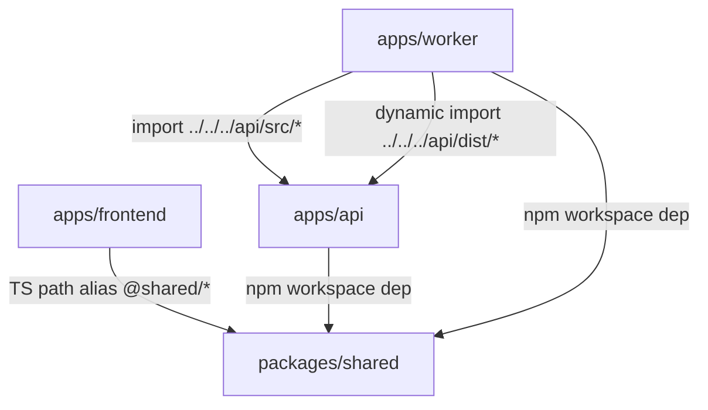

# 03 — Mapa zależności i importów

## Zależności między aplikacjami (runtime)

### Komunikacja HTTP

- Frontend → API:
  - Next.js rewrite (`apps/frontend/next.config.ts`):
    - `/api/:path*` → `http://localhost:3001/api/:path*`

### Baza danych i auth

- Frontend → Supabase:
  - Supabase Auth (SSR)
- API → Supabase:
  - operacje DB (service role)
- Worker → Supabase:
  - operacje DB (service role)

### Kolejki

- API → Redis/BullMQ:
  - enqueue jobów (`transcription-jobs`, `vision-jobs`, `document-process-jobs`)
- Worker → Redis/BullMQ:
  - przetwarzanie jobów

## Zależności kodowe (build-time / importy)

### `packages/shared`

- `apps/api` importuje `@aasystent-radnego/shared` jako dependency workspace.
- `apps/worker` importuje `@aasystent-radnego/shared` jako dependency workspace.
- `apps/frontend` importuje kod shared przez alias TS `@shared/*` (bezpośrednio do `packages/shared/src/*`).

## Cross-importy między aplikacjami (ważne)

W `apps/worker` występują **bezpośrednie importy** z `apps/api`.

### Importy z `apps/api/src/*`

Znalezione ścieżki (na podstawie grep w `apps/worker/src`):

- `apps/worker/src/jobs/transcription.ts`
  - import typów i kontraktu joba:
    - `../../../api/src/services/transcription-queue.js`
  - import serwisów API:
    - `../../../api/src/services/youtube-downloader.js`
    - `../../../api/src/ai/index.js`

- `apps/worker/src/jobs/transcription-progress.ts`
  - import typów:
    - `../../../api/src/services/transcription-queue.js`

- `apps/worker/src/index.ts`
  - import typów:
    - `../../api/src/services/transcription-queue.js`

**Konsekwencje:**

- Worker jest sprzężony z wewnętrzną strukturą API (`src/*`).
- Wymaga zgodności ustawień TypeScript/ESM (importy z sufiksem `.js`).

### Dynamiczne importy z `apps/api/dist/*`

- `apps/worker/src/jobs/document-process.ts`:
  - `../../../api/dist/services/document-processor.js`
  - `../../../api/dist/services/audio-transcriber.js`

**Konsekwencje:**

- Worker wymaga wcześniejszego zbudowania API (`apps/api/dist/*`) dla części funkcjonalności.
- Jest to coupling na poziomie artefaktów build.

## Diagram (zależności kodowe)

## Notatki o spójności

- W repo istnieją **dwie** implementacje przetwarzania `transcription-jobs`:
  - worker w `apps/worker`
  - worker w `apps/api`

Jeżeli oba procesy są uruchomione równolegle, muszą mieć:

- spójny kontrakt jobów
- spójne efekty uboczne (np. zapis do `processed_documents`)
- spójne nazewnictwo `document_type` i metadanych (w kodzie występują różnice — szczegóły w `08-kolejki-i-kontrakty.md`).
