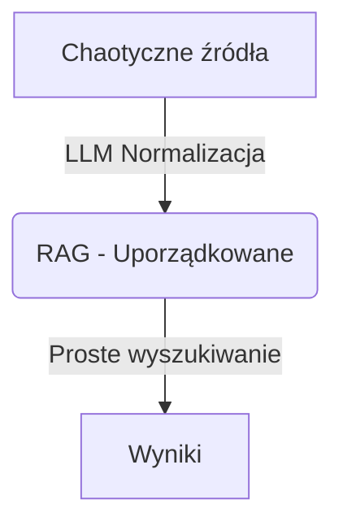

# Architektura Normalizacji Danych - "Uporządkuj Chaos na Wejściu"

## Filozofia

**Problem:** Różne źródła danych (BIP, YouTube, System Rada) używają różnych formatów, konwencji nazewnictwa i struktur. Próba obsługi tego chaosu przez skomplikowane wyszukiwanie (regex, 10+ wzorców ILIKE) jest nieefektywna i krucha.

**Rozwiązanie:** Normalizuj dane **podczas zapisu do RAG**, nie podczas wyszukiwania.



---

## Architektura

### 1. Ustandaryzowany Schemat Metadanych

Każdy dokument w RAG ma **jednolity format metadanych**, niezależnie od źródła:

```typescript
interface NormalizedDocumentMetadata {
  // Typ dokumentu (znormalizowany)
  documentType: "resolution" | "protocol" | "transcription" | "session_materials" | ...

  // Poziom hierarchii (1-5, gdzie 1 = najważniejszy)
  hierarchyLevel: 1 | 2 | 3 | 4 | 5;

  // Powiązanie z sesją (ZAWSZE liczba arabska)
  sessionInfo?: {
    sessionNumber: number;        // 23, NIE "XXIII"
    sessionType?: "ordinary" | "extraordinary" | "budget";
    sessionDate?: string;         // ISO 8601
  };

  // Tematy (znormalizowane)
  topics: string[];               // ["budżet gminy", "oświata", "drogi"]

  // Pewność identyfikacji
  confidence: {
    overall: number;              // 0-100%
    sessionNumber?: number;
    documentType?: number;
  };

  // Źródło
  source: {
    origin: string;               // "BIP", "YouTube", "System Rada"
    url?: string;
    scrapedAt: string;
  };
}
```

### 2. LLM-Based Normalizacja (DocumentNormalizer)

**Lokalizacja:** `apps/api/src/services/document-normalizer.ts`

**Proces:**

```typescript
const normalizer = new DocumentNormalizer(userId);

// Przykład 1: Chaotyczny tytuł z różnych źródeł
await normalizer.normalize({
  title: "Sesja Nr XXIII | Urząd Miejski w Drawnie | System Rada",
  sourceType: "System Rada",
});
// → sessionNumber: 23 (arabski!), documentType: "session_materials"

await normalizer.normalize({
  title: "XIV Sesja Rady Miejskiej - transmisja na żywo",
  sourceType: "YouTube",
});
// → sessionNumber: 14, documentType: "video"

await normalizer.normalize({
  title: "Protokół z 45 sesji Rady Gminy",
  sourceType: "BIP",
});
// → sessionNumber: 45, documentType: "protocol"
```

**LLM Prompt (uproszczony):**

```text
Wyodrębnij metadane z dokumentu:

Tytuł: "Sesja Nr XXIII | Urząd Miejski..."

Zwróć JSON:
{
  "documentType": "session_materials",
  "sessionNumber": 23,          // ZAWSZE arabski!
  "topics": ["sesja rady"],
  "confidence": 95
}
```

### 3. Integracja ze Scraperem

**Przed (intelligent-scraper.ts):**

```typescript
// Zapis surowych danych
await supabase.from("scraped_content").insert({
  title: rawTitle, // "Sesja Nr XXIII | Urząd..."
  metadata: {}, // Puste lub minimalne
});
```

**Po:**

```typescript
// Normalizacja PRZED zapisem
const normalizer = new DocumentNormalizer(userId);
const normalized = await normalizer.normalize({
  title: rawTitle,
  content: rawContent,
  sourceType: "System Rada",
});

await supabase.from("scraped_content").insert({
  title: rawTitle,
  metadata: normalized, // ✅ Uporządkowane metadane!
});
```

### 4. Uproszczone Wyszukiwanie

**Przed (document-query-service.ts):**

```typescript
// 10+ wzorców ILIKE dla różnych formatów
query.or(
  `title.ilike.%sesja ${sessionNumber}%,` +
  `title.ilike.%sesji ${sessionNumber}%,` +
  `title.ilike.%sesja nr ${sessionNumber}%,` +
  `title.ilike.%sesji nr ${sessionNumber}%,` +
  `title.ilike.%sesja ${romanNum}%,` +
  `title.ilike.%sesji ${romanNum}%,` +
  // ... i jeszcze 4 inne!
);
```

**Po:**

```typescript
// Proste zapytanie po znormalizowanych metadanych
const { data } = await supabase
  .from("processed_documents")
  .select("*")
  .eq("user_id", userId)
  .eq("metadata->sessionInfo->sessionNumber", 23); // ✅ Zawsze liczba!
```

---

## Korzyści

### ✅ Prostota Wyszukiwania

- Brak regex
- Brak 10+ wzorców ILIKE
- Proste zapytania po strukturalnych metadanych

### ✅ Odporność na Różnice Źródłowe

```text
"Sesja Nr XXIII"           → sessionNumber: 23
"XIV Sesja Rady"           → sessionNumber: 14
"45 posiedzenie"           → sessionNumber: 45
"XXIII Sesja budżetowa"    → sessionNumber: 23, sessionType: "budget"
```

Wszystkie normalizowane do **jednego formatu**.

### ✅ Inteligentna Klasyfikacja

LLM rozumie kontekst:

```text
"Protokół z sesji"         → documentType: "protocol"
"Uchwała budżetowa"        → documentType: "resolution", topics: ["budżet"]
"Transmisja na żywo"       → documentType: "video"
```

### ✅ Pewność Danych

```typescript
confidence: {
  overall: 95,              // Wysoka pewność
  sessionNumber: 90,        // LLM pewny numeru sesji
}
```

Możemy filtrować po pewności: `WHERE confidence->overall > 80`

### ✅ Łatwość Rozbudowy

Dodanie nowego źródła danych:

1. Scraper pobiera surowe dane
2. DocumentNormalizer automatycznie normalizuje
3. Wyszukiwanie działa bez zmian!

---

## Migracja

### Krok 1: Normalizacja Istniejących Danych

```typescript
// Skrypt migracyjny
const normalizer = new DocumentNormalizer(userId);

const { data: existingDocs } = await supabase
  .from("processed_documents")
  .select("id, title, content, metadata");

for (const doc of existingDocs) {
  const normalized = await normalizer.normalize({
    title: doc.title,
    content: doc.content,
    sourceType: doc.metadata?.source || "unknown",
  });

  await supabase
    .from("processed_documents")
    .update({ metadata: normalized })
    .eq("id", doc.id);
}
```

### Krok 2: Aktualizacja Scraperów

Wszystkie scrapery używają `DocumentNormalizer` przed zapisem:

- `intelligent-scraper.ts` - scraping BIP, System Rada
- `youtube-session-service.ts` - scraping YouTube
- `transcription-job-service.ts` - zapis transkrypcji

### Krok 3: Uproszczenie Wyszukiwania

Refaktoryzacja:

- `document-query-service.ts` - usuń regex, użyj metadanych
- `document-scorer.ts` - usuń 10+ wzorców ILIKE
- `intelligent-rag-search.ts` - uproszczone zapytania

---

## Przykłady Użycia

### Przykład 1: Wyszukiwanie Sesji

**Stare:**

```typescript
// Skomplikowane wzorce
const patterns = [
  `Sesja Nr ${romanNumber}`,
  `Sesja nr ${romanNumber}`,
  `sesja ${romanNumber}`,
  `Sesja Nr ${arabicNumber}`,
  // ... i 4 inne
];

for (const pattern of patterns) {
  await supabase.ilike("title", `%${pattern}%`);
}
```

**Nowe:**

```typescript
// Proste zapytanie
const { data } = await supabase
  .from("processed_documents")
  .select("*")
  .eq("metadata->sessionInfo->sessionNumber", 23);
```

### Przykład 2: Wyszukiwanie po Temacie

**Stare:**

```typescript
// Fulltext search w treści (wolne, niedokładne)
.textSearch("content", "budżet OR finanse OR wydatki");
```

**Nowe:**

```typescript
// Zapytanie po znormalizowanych tematach
.contains("metadata->topics", ["budżet gminy"]);
```

### Przykład 3: Filtrowanie po Pewności

```typescript
// Tylko dokumenty z wysoką pewnością identyfikacji
const { data } = await supabase
  .from("processed_documents")
  .select("*")
  .gte("metadata->confidence->overall", 80)
  .eq("metadata->sessionInfo->sessionNumber", 23);
```

---

## Monitoring i Jakość Danych

### Dashboard Jakości

```sql
-- Statystyki pewności
SELECT
  metadata->>'documentType' as type,
  AVG((metadata->'confidence'->>'overall')::int) as avg_confidence,
  COUNT(*) as count
FROM processed_documents
GROUP BY metadata->>'documentType';
```

### Alerty Niskiej Pewności

```typescript
// Dokumenty wymagające ręcznej weryfikacji
const { data: lowConfidence } = await supabase
  .from("processed_documents")
  .select("*")
  .lt("metadata->confidence->overall", 50);

// Wyślij powiadomienie do admina
```

---

## Podsumowanie

### Przed

- ❌ 10+ wzorców regex/ILIKE
- ❌ Kruche wyszukiwanie
- ❌ Trudna rozbudowa
- ❌ Brak standaryzacji

### Po

- ✅ LLM normalizuje dane na wejściu
- ✅ Proste zapytania SQL
- ✅ Łatwa rozbudowa
- ✅ Jednolity format dla wszystkich źródeł
- ✅ Monitoring jakości danych

**Filozofia:** Uporządkuj chaos NA WEJŚCIU, nie walcz z nim NA WYJŚCIU.
